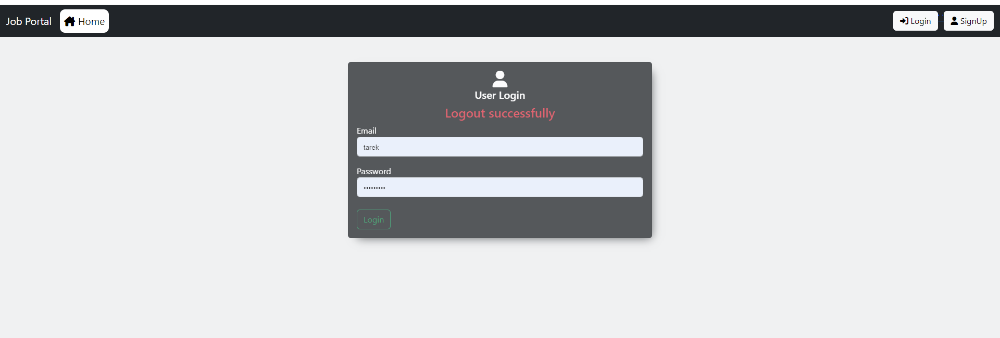
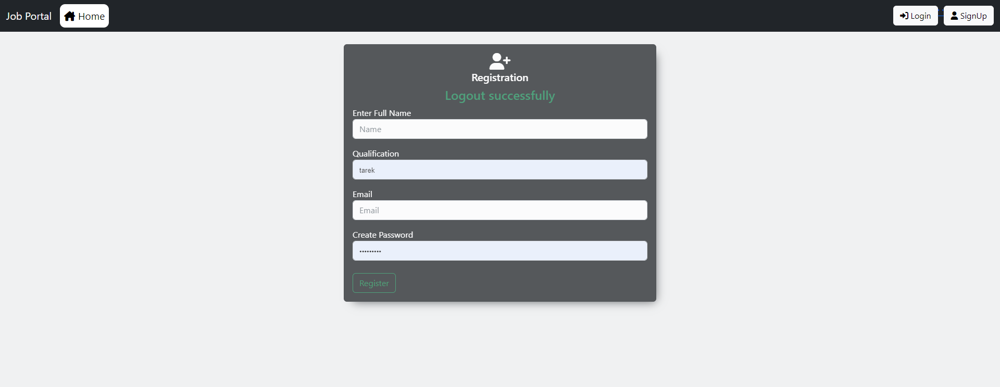
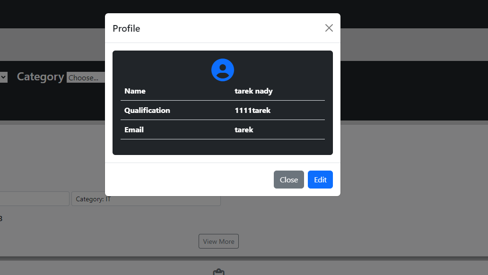
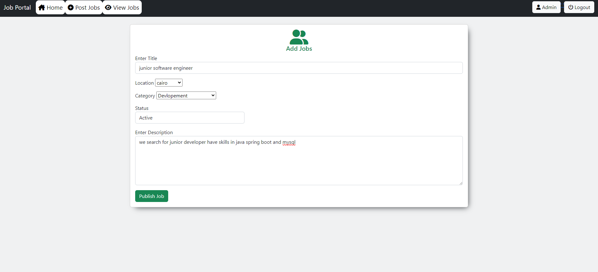
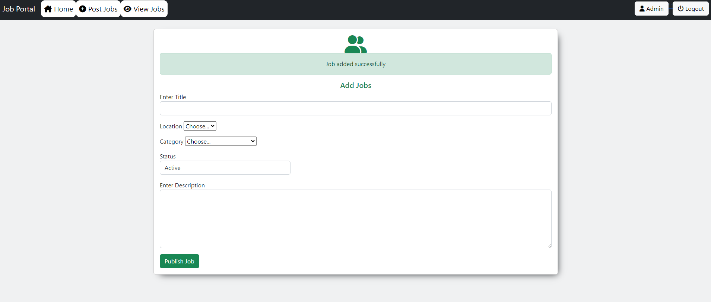
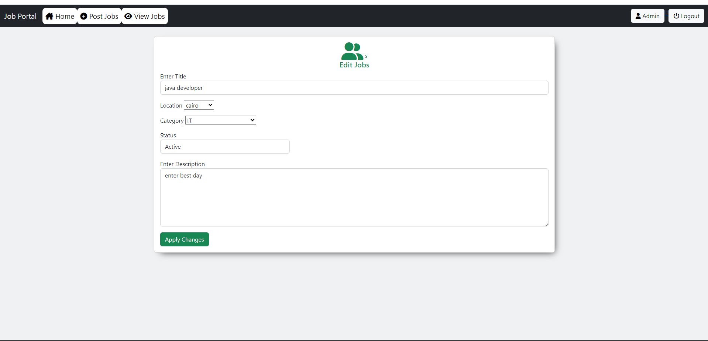
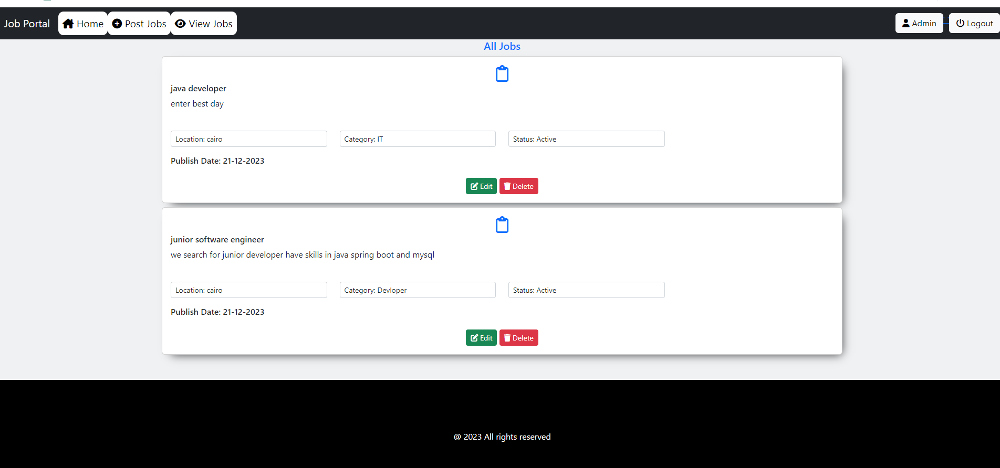
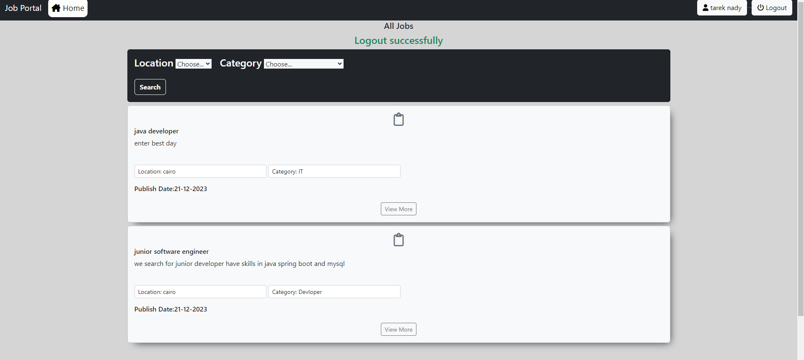

** Project Overview **
- This project is a dynamic web application developed using Java, incorporating a blend of technologies such as Servlets, JavaServer Pages (JSP), and the Java Standard Tag Library (JSTL).
- It leverages MySQL for database management,ensuring robust data handling and storage capabilities. 
- The frontend is designed with HTML and enhanced with Bootstrap, making the user interface responsive and visually appealing. CSS is used for further styling, allowing for a more customized and engaging user experience.

** Prerequisites **
- install Java Development Kit (JDK) version [at least version 8]
- install Apache Tomcat Server [use version 10.1]
- install mysql database[use version 8]
- install maven build tool

1-Clone the repository to your local machine.
2-setting up you server to project
3-apply configueration of database in application.properties
4-Start the Apache Tomcat server.
5-Access the application via http://localhost:[port] you put in application.properties

## Technologies

** Features **
you can login page and logout page
<figure>
     
    
</figure>

you can register for new account
<figure>
     
    
</figure>

you have profile page for you
<figure>
     
    
</figure>

you can update your profile
<figure>
     
    
</figure>

you can publish jobs
<figure>
     
    
</figure>

you can publish jobs successfully
<figure>
     
    
</figure>

you can edit jobs
<figure>
     
    
</figure>

you can view jobs
<figure>
     
    
</figure>

you can view more jobs
<figure>
     
    
</figure>

you can delete jobs 
<figure>
     
    
</figure>

## FAQ
- Feel free to ask me any questions

## License

This project is licensed under the MIT License - see the [LICENSE](LICENSE) file for details.

